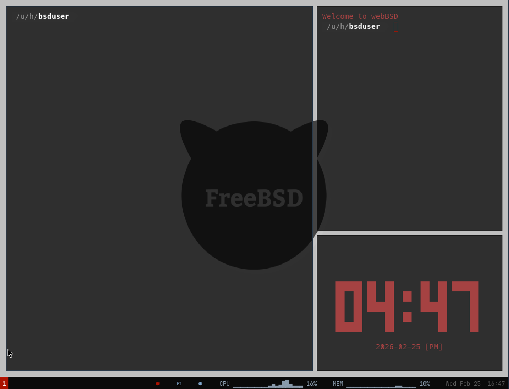

# webBSD

FreeBSD 13.5 i386 with an i3 graphical desktop, running in the browser via x86 emulation.



**[Live Demo](https://webbsd.widgetry.org/)**

## Overview

webBSD uses [v86](https://github.com/copy/v86) to emulate x86 hardware in WebAssembly. A compressed saved state (~61 MB) restores directly to the desktop without a full boot. Networking is handled by a [WISP](https://github.com/nicvagn/wisp-protocol) proxy — TCP connections from the guest are forwarded through the server to the internet. DHCP, DNS (via DoH), and general TCP all work.

## Software

**Desktop** — i3 with gaps, urxvt terminals with transparency, dmenu, feh wallpaper, custom i3bar with CPU/memory graphs and clickable controls.

**Shell** — fish with custom prompt, tmux with status bar, vim with Hybrid colorscheme.

**Networking** — Midori browser (WebKit), curl, wget, fetch. TCP/IP via WISP proxy.

**Monitoring** — gotop, htop, tty-clock (`clock` alias), cava audio visualizer.

**Audio** — SB16 emulation, PulseAudio with OSS bridge.

**System** — FreeBSD 13.5-RELEASE i386, PF firewall, auto-login to graphical desktop, 3 GB RAM, 10 GB disk.

## Run Locally

Requires Node.js 18+ and ~12 GB disk space.

```sh
git clone https://github.com/nicvagn/webbsd.git
cd webbsd
npm install
npm run dev
```

Open **http://localhost:8080** in a browser with SharedArrayBuffer support (Chrome, Edge, Firefox).

The server handles static files with range requests, COOP/COEP headers, and the WISP proxy.

### URL Parameters

| Parameter | Effect |
|---|---|
| `?nostate` | Full cold boot, bypasses saved state (~2 min) |
| `?relay=wisp://host/` | Alternate WISP proxy |
| `?relay=fetch` | Fetch backend (HTTP only, no proxy needed) |

## Build from Scratch

Requires QEMU (`qemu-system-i386`) and Python 3.

```sh
npm run build:image       # Build FreeBSD disk image
npm run install-x11       # Install X11, i3, packages via QEMU
python3 scripts/prepare-desktop.py   # Write desktop configs
npm run save-state        # Generate saved state at desktop
```

### npm Scripts

| Script | Description |
|---|---|
| `npm run dev` | Dev server with WISP proxy on port 8080 |
| `npm test` | Boot test (v86, Node.js) |
| `npm run save-state` | Generate compressed saved state |
| `npm run fix-image` | Patch image config via QEMU serial |
| `npm run install-x11` | Install X11 + i3 + packages |

## Configuration

Build parameters in `webbsd.conf`:

```
FREEBSD_VERSION=13.5
ARCH=i386
DISK_SIZE=10G
V86_MEMORY=3072
V86_VGA_MEMORY=64
HOSTNAME=webbsd
USERNAME=bsduser
TIMEZONE=America/Boise
X11_RESOLUTION=1280x1024
```

## Networking

The WISP proxy is built into `server.mjs` via `@mercuryworkshop/wisp-js`.

- **DHCP** — local, handled by v86 (guest IP: `192.168.86.100`)
- **DNS** — resolved via DNS-over-HTTPS in the browser
- **TCP** — proxied through WISP to the internet
- **ICMP** — simulated locally

A watchdog in `/etc/rc.local` keeps DHCP alive. For production, any WISP-compatible proxy will work.

## Project Structure

```
index.html              Entry point (v86 config, loading UI)
server.mjs              Dev server (HTTP + WISP proxy)
webbsd.conf             Build configuration
images/
  freebsd.img           10 GB raw disk image
  freebsd_state.bin.zst Compressed saved state (~61 MB)
scripts/
  save-state.mjs        Generate saved state
  install-x11.py        Install X11 + i3 + packages
  prepare-desktop.py    Write desktop configs
  fix-image.py          Patch hostname, SSH, loader.conf
v86/
  build/libv86.js       v86 emulator (JS)
  build/v86.wasm        v86 emulator (WASM)
  bios/                 SeaBIOS + VGA BIOS
```

## Deployment

Host static files on a server with range request support (the 10 GB disk image rules out most CDNs). Run a WISP proxy for networking. Set `Cross-Origin-Opener-Policy: same-origin` and `Cross-Origin-Embedder-Policy: require-corp` headers.

## Keyboard Shortcuts

| Key | Action |
|---|---|
| `$mod+Return` | Open terminal |
| `$mod+d` | dmenu launcher |
| `$mod+Shift+q` | Close window |
| `$mod+1-9` | Switch workspace |
| `$mod+h/v` | Split horizontal/vertical |
| `Esc` | Release mouse capture |

`$mod` is the Super key.

## Credits

- [v86](https://github.com/copy/v86) — Fabian Hemmer
- [FreeBSD](https://www.freebsd.org/) — The FreeBSD Project
- [JSLinux](https://bellard.org/jslinux/) — Fabrice Bellard
- [wisp-js](https://github.com/nicvagn/wisp-js) — Mercury Workshop

## License

MIT
